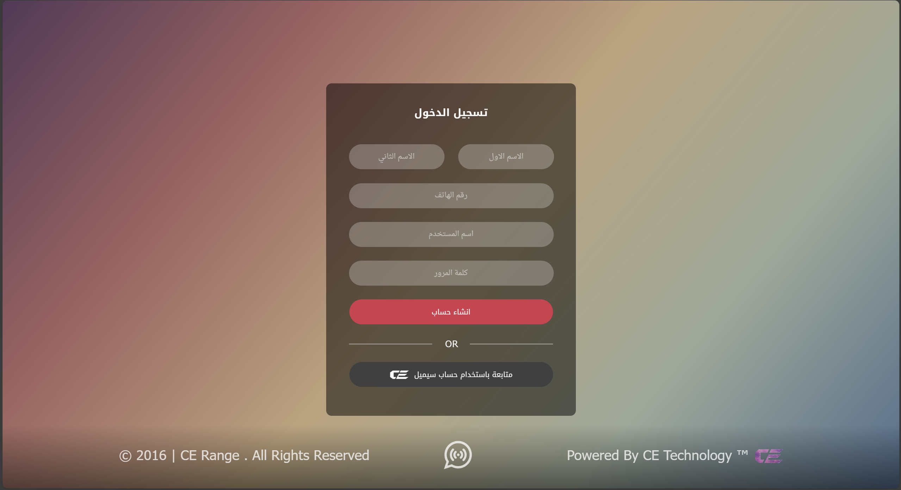

# My First Project in the Field (Social Media Platform)  

## About the Project

In 2016, at just 12 years old, I created my very first project—a social media platform—using PHP. This project holds a special place in my heart as it was my introduction to the world of programming. It's not the cleanest code, but it's a testament to how far I've come since then.

## Screenshots
Check out the screenshots above to see the interface I designed back then. It's simple, but it worked!

## Just Me Being Real
At 12, I was curious about how platforms like Facebook and Twitter worked, so I thought, why not make my own? The code might be messy, but it was a huge deal for me back then. I figured out how to make users log in, post stuff, follow each other, and more—all with no prior experience. Looking back, it’s wild to see how much I learned from just diving in.

## Credits
This project was 100% built by me when I was 12 years old. It might be messy, but it's mine!

---

If you’re just starting out, this is your sign to keep going. Everyone starts somewhere—even with messy code. The important thing is to start!
